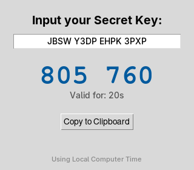

<h1 align="center">Simple TOTP</h1>

<p align="center">
  <strong>A standalone desktop 2FA code generator — pure Python standard library, no accounts, no cloud.</strong>
</p>

<!-- TODO: Add a screenshot -->
<!--  -->

---

## What is Simple TOTP?

Simple TOTP is a small desktop authenticator: paste in a 2FA secret key and it generates the same 6-digit codes your phone app would, refreshing every 30 seconds. It implements the [RFC 6238](https://datatracker.ietf.org/doc/html/rfc6238) TOTP standard from scratch using only Python's standard library — no third-party packages to install, nothing stored, nothing sent anywhere.

## Features

- **Real-time code generation** — 6-digit TOTP codes, displayed as `123 456` and refreshed live
- **Network time sync** — Corrects for local clock drift by reading the `Date` header from a single HEAD request to Google, falling back to local time if offline
- **One-click copy** — Click the code itself or press the button to copy it to your clipboard
- **Visual countdown** — Shows seconds remaining and turns red when the code is about to expire
- **Zero dependencies** — HMAC-SHA1, Base32 decoding, and the GUI all come from the standard library

## Getting Started

No `pip install` needed — just Python with tkinter (included on Windows/macOS; on minimal Linux installs run `sudo apt install python3-tk`).

```bash
# Clone the repo
git clone https://github.com/evol1228/simple-totp.git
cd simple-totp

# Run it
python totp.py
```

Enter your secret key (Base32 format — spaces are fine, case doesn't matter) and the current code appears immediately.

## Getting your secret key

Most services show the raw key when you set up 2FA:

- Look for **"Can't scan the QR code?"** or **"Manual entry"** during setup
- Copy the provided key — usually 16–32 characters using `A–Z` and `2–7`

## How it works

Each 30-second window, the app packs the current Unix time step into bytes, HMAC-SHA1 signs it with your Base32-decoded secret, dynamically truncates the hash per RFC 4226, and takes the result modulo 1,000,000. The status bar tells you whether it's running on synced network time or your local clock.

## Building a standalone executable

Optional — compile to a single binary with Nuitka:

```bash
pip install -r requirements.txt
python -m nuitka --standalone --onefile --windows-disable-console totp.py
```

## License

[MIT](LICENSE) — Use it, modify it, ship it. No strings attached.

---

<p align="center">
  Built by <a href="https://github.com/evol1228">@evol1228</a>
</p>
